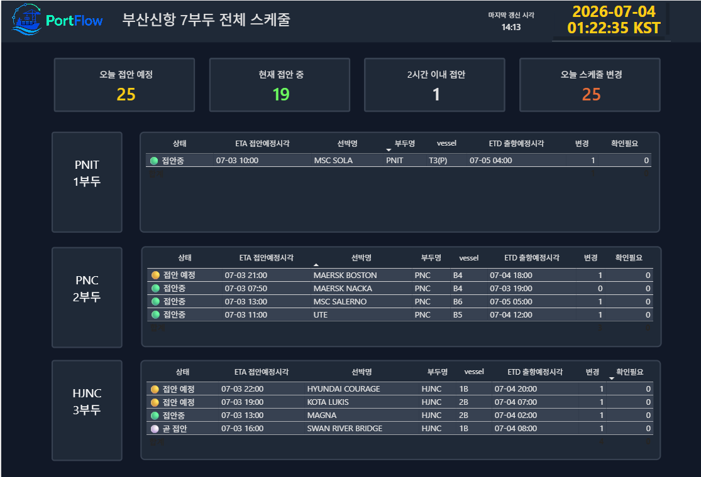
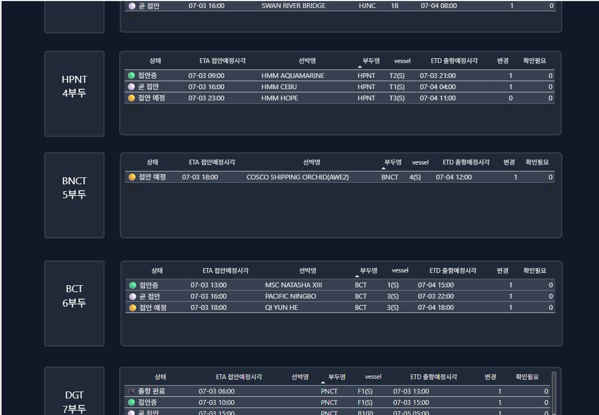
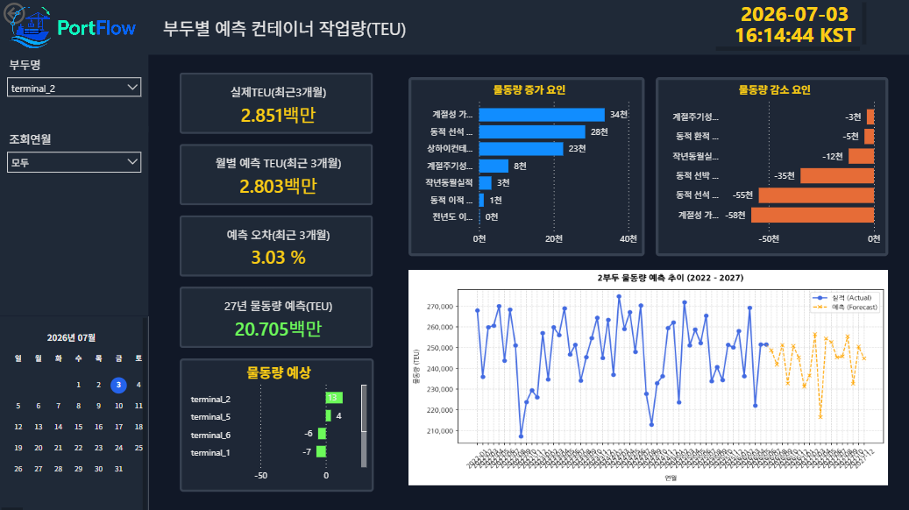
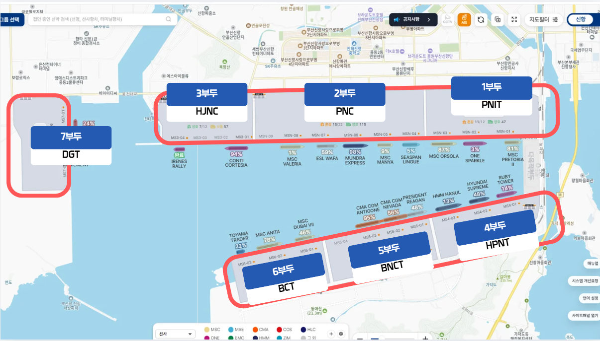
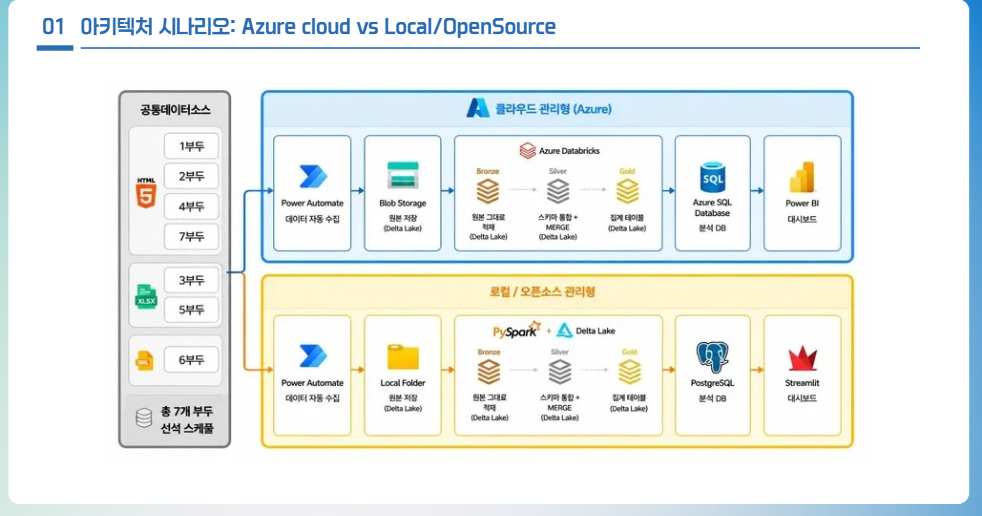

# 🚢 PortFlow
## Azure-Based Berth Schedule Integration & Workload Prediction Dashboard for 7 Terminals at Busan New Port

🌐 Language: [English](./README.md) | [한국어](./README.ko.md)

> Built on the real field needs of customs officers at Busan New Port,
> this Azure-based port operations data pipeline project
> integrates berth schedules scattered across 7 terminals
> and monitors schedule change history and hourly workload.

<br/>







<br/>


---

## ⛴️ Project Overview

**PortFlow** is a **smart port operations monitoring service** designed to integrate berthing schedules across 7 terminals at Busan New Port, allowing users to view schedule change history and terminal-level workload on a single screen.

This project was carried out as the 2nd project of Microsoft Data School Cohort 4. We implemented both an Azure environment and a Local/Open-source environment, and compared them in terms of cost, security, and operational efficiency.

<br/>

---

## 🌊 Why Busan New Port?

Busan New Port is Korea's largest container hub and a leading port undergoing smart port transformation.

The following trends are driving increased demand for maritime and port data-based operational services:

- A large-scale container hub built on 7 terminals at Busan New Port
- Ongoing push toward AI-based smart port transformation
- Growing demand for maritime/port data utilization following the relocation of the Ministry of Oceans and Fisheries to Busan
- Concentration of the shipping and logistics ecosystem (e.g., HMM) in Busan
- Existing demand for integrated monitoring tools among customs, quarantine, and port operators



<br/>

---

## 👮 Field Requirement

This project was designed based on **interviews with actual customs officers working at Busan New Port**.

When a foreign vessel berths, customs officers board the ship in person to carry out customs inspections. To do this, they need to quickly check each terminal's berthing schedule and any changes to it.

However, the existing workflow had the following problems:

### Pain Points

- Schedules are scattered across 7 different terminal operator websites
- Officers must log into each site every morning and manually download files
- File formats, column names, and column order differ by terminal, requiring manual consolidation in Excel
- Berthing and departure times change multiple times a day, making it hard to track changes immediately
- No single screen exists to view terminal workload and cargo volume forecasts together

<br/>

### Project Pivot

The initial idea was a data quality guardrail pipeline for port data.

However, through officer interviews, we found that the field's top priority wasn't a data quality report itself, but rather **"viewing all 7 terminal schedules on one screen and quickly catching changes."**

Based on this insight, we shifted the project's direction from a **data quality inspection focus** to **PortFlow, a service centered on schedule integration, change detection, and workload prediction dashboards**.

<br/>

---

## 📌 Key Features

### 1️⃣ Integration of Schedules Across 7 Terminals at Busan New Port

We integrated berth schedules scattered across each terminal operator's website, so customs and quarantine officers can check upcoming vessel arrivals on a single screen.

<br/>

### 2️⃣ Schedule Change Detection

We used `business_key`, `row_hash`, `snapshot_id`, and `parsed_at` to detect schedule changes.

Detected change types include:

- ETA changes
- ETD changes
- Closing time changes
- Terminal changes
- Workload changes
- New schedule additions
- Deleted or "needs confirmation" schedule status

<br/>

### 3️⃣ Operating-Day Design Based on Nighttime Port Operations

Since port operations often continue past midnight, we designed an `eta_work_date` field based on a 6 AM cutoff instead of a simple calendar date.

This allows a schedule at 11:30 PM that gets changed to 12:30 AM the next day to still be tracked as the same operating schedule, rather than being treated as a new one.

<br/>

### 4️⃣ Gold Layer Service Tables

We built purpose-specific service tables in the Databricks Gold Layer so they could be used directly by Power BI and the ML model.

- `gold_integrated_schedule`
- `gold_schedule_change_history`
- `gold_today_terminal_schedule`
- `gold_hourly_terminal_workload`
- `gold_monthly_container`
- `gold_ml_feature_table`

<br/>

### 5️⃣ Power BI Monitoring Dashboard

Using Gold/Mart data loaded into Azure SQL DB, we visualized terminal schedules, change history, urgent alerts, hourly workload, and cargo volume forecast results.

<br/>

### 6️⃣ Azure vs. Local Operations Comparison

Using the same service logic, we compared an Azure-based architecture against a Local/Open-source architecture.

Comparison criteria included:

- Build time
- Service cost
- Security
- Operational efficiency
- Ease of failure tracing and recovery
- Dashboard sharing methods

<br/>

---

## 🏗️ Architecture




### Azure Architecture

```text
Power Automate
    ↓
Azure Blob Storage
    ↓
Azure Databricks
    ├── Bronze Layer
    ├── Silver Layer
    └── Gold Layer
    ↓
Azure SQL Database
    ↓
Power BI
````
### Local Architecture

```text
Power Automate
    ↓
Local Folder
    ↓
PySpark + Delta Lake
    ├── Bronze Layer
    ├── Silver Layer
    └── Gold Layer
    ↓
PostgreSQL
    ↓
Streamlit
```

<br/>

### Medallion Architecture

```text
Raw Data
  ↓
Bronze Layer
  - Preserve raw data
  - Add ingestion metadata
  - Manage tracking columns such as snapshot_id, row_hash

  ↓
Silver Layer
  - Standardize columns across terminals
  - Clean data types
  - Generate eta_work_date
  - Generate business_key
  - Separate and preserve rows that fail validation

  ↓
Gold Layer
  - Integrated schedule table
  - Change history table
  - Today's schedule table
  - Hourly workload table
  - ML feature table
  - Mart view for Power BI integration
```

<br/>

---

## 🙋‍♀️ My Role

<br/>

### Owned

* Implemented the Azure Databricks Gold Layer
* Designed and implemented Gold service tables in SQL
* Reviewed the integration architecture from Azure Blob Storage → Databricks → Azure SQL DB
* Practiced Databricks Unity Catalog permission configuration
* Managed Storage Credential / External Location permissions
* Compared Azure SQL DB authentication methods

  * Microsoft Entra ID
  * SQL Authentication
* Implemented part of the Power BI monitoring dashboard's DAX measures
* Defined schedule change alerts and operational metrics

<br/>

### Designed

* Wrote the Bronze / Silver / Gold Medallion Architecture design document
* Designed the `business_key` used for schedule change detection
* Designed `eta_work_date`, accounting for nighttime port operations
* Designed the Gold Table → Mart View → Power BI structure
* Designed the Azure SQL DB permission separation strategy

<br/>

### Collaborated

* Raw data collection automation
* Bronze Layer implementation
* Silver Layer implementation
* ML-based cargo volume forecasting
* Local/Open-source pipeline implementation
* Streamlit dashboard implementation

<br/>

---

## 💻 Tech Stack

### Cloud & Data Platform

* Azure Blob Storage
* Azure Databricks
* Azure SQL Database
* Microsoft Entra ID
* Unity Catalog
* Azure Storage Credential
* External Location
  


<br/>

### Data Engineering

* PySpark
* Spark SQL
* Delta Lake
* Medallion Architecture
* Parquet
* SQL View / Mart Table
  


<br/>

### BI & Visualization

* Power BI
* DAX
* Dashboard KPI Design
* Schedule Monitoring Dashboard


<br/>

### Collaboration

* GitHub
* Notion
* Microsoft Teams


<br/>

---

## 📂 Repository Structure

```text
portflow-busan-newport-monitoring/
│
├── README.md
│
├── docs/
│   ├── 01_business_context.md
│   ├── 02_requirements_from_field_interview.md
│   ├── 03_architecture_azure_vs_local.md
│   ├── 04_medallion_design.md
│   ├── 05_security_and_permission_design.md
│   ├── 06_powerbi_dashboard_design.md
│   ├── 07_troubleshooting.md
│   └── 08_future_improvements.md
│
├── notebooks/
│   ├── 01_raw_to_temp_parquet_header_standardization.sql
│   ├── 03_silver_to_gold.sql
│   └── exported_html/
│       └── 03_silver_to_gold.html
│
├── sql/
│   ├── databricks/
│   │   ├── create_gold_tables.sql
│   │   ├── grant_external_location_permissions.sql
│   │   └── unity_catalog_permissions.sql
│   │
│   └── azure_sql_db/
│       ├── create_schemas.sql
│       ├── create_mart_views.sql
│       ├── create_users_roles_future_plan.sql
│       └── table_type_mapping.md
│
├── powerbi/
│   ├── dax/
│   │   ├── schedule_alert_measures.dax
│   │   ├── last_refresh_measures.dax
│   │   └── workload_measures.dax
│   ├── screenshots/
│   │   ├── dashboard_schedule_board.png
│   │   ├── dashboard_change_history.png
│   │   └── dashboard_forecast.png
│   └── README.md
│
├── data_samples/
│   ├── sample_gold_today_terminal_schedule.csv
│   ├── sample_gold_schedule_change_history.csv
│   └── README.md
│
└── assets/
    ├── architecture_azure.png
    ├── medallion_architecture.png
    ├── dashboard_preview.png
    └── presentation/
        └── portflow_presentation.pdf
```

<br/>

---

## 🛡️ Security & Permission Design

Beyond simply implementing the data pipeline, this project also reviewed data access permissions and authentication methods in the Azure environment.

<br/>

### Implemented in MVP

* Connected an Azure Blob Storage container as a Databricks External Location
* Created a Storage Credential and configured External Location permissions
* Verified Catalog / Schema / Table access permissions via Databricks Unity Catalog
* Tested both Microsoft Entra ID and SQL Authentication methods for Azure SQL DB connections
* Reviewed approaches to managing connection credentials via secrets
* Identified the need to separate read permissions from administrative permissions

<br/>

### Future Security Improvements

In a future production environment, we plan to further organize permissions as follows:

* Permission separation based on Microsoft Entra ID groups

  * Data Engineer Group
  * BI Developer Group
  * Viewer Group
* Role-Based Access Control within Azure SQL DB

  * Read-only role
  * Load-only role
  * Mart View management role
* Separate access permissions for Gold Tables and Mart Views
* Separate production and development accounts
* Manage connection strings via Secret Scope
* Strengthen audit logging and access history monitoring

<br/>

---

## 📊 Power BI Dashboard

The Power BI dashboard connects to Gold/Mart data in Azure SQL DB using Import mode.

<br/>

### Dashboard Pages

1. Busan New Port integrated berth schedule board
2. Schedule change history and priority alerts
3. Terminal-level workload and cargo volume forecast

<br/>

### Implemented DAX

* Urgent schedule change count
* Filtering for vessels berthing within 2 hours of the current time
* Last data refresh timestamp display
* Aggregated expected workload by terminal
* Count of changes by change type
* Terminal filtering and date slicer integration

<br/>

---

## 📋 Result

PortFlow was implemented as an MVP based on the real workflow of field officers, delivering the following capabilities:

* Integrated schedule lookup across 7 terminals
* Hourly schedule refresh structure
* Detection of ETA / ETD / Closing / terminal changes
* Change history and priority alerts
* Terminal-level, time-of-day workload visualization
* Integrated cargo volume forecast results
* Comparative analysis of Azure vs. Local operations

<br/>

---

## 👏 Future Improvements

* Upgrade collection automation via a paid Power Automate plan or Python-based web scraping
* Build a scheduled execution structure using Databricks Job Triggers
* Establish a permission structure based on Microsoft Entra ID
* Apply role-based access control within Azure SQL DB
* Improve the BI access structure to be centered around Mart Views
* Automate ML model retraining and manage model versions with MLflow
* Further evaluate serverless computing scenarios
* Integrate change alerts with Teams, Email, and internal company portals

<br/>

---

## 📝 Note

This repository presents the results of a team project, organized from an individual portfolio perspective.

It focuses on the areas I personally designed and implemented: Azure permission/authentication configuration, Databricks Gold Layer implementation, SQL/Mart design, and Power BI DAX and dashboard implementation.

Raw data collection automation, Bronze/Silver implementation, ML modeling, and the Local pipeline were collaborative work shared among team members.
